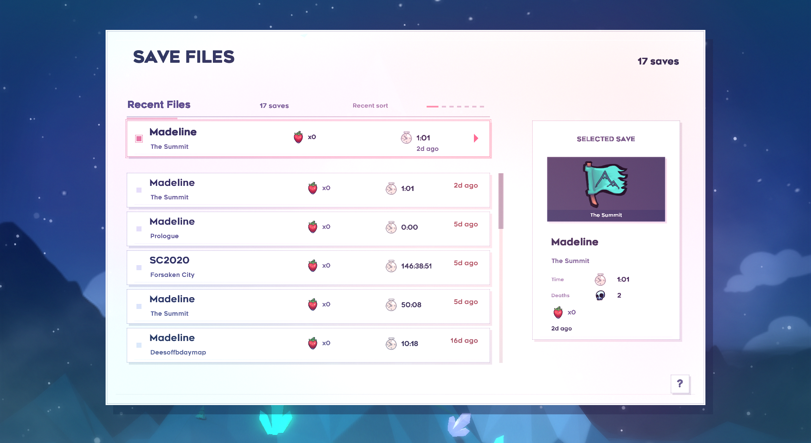

<p align="center">
  
</p>

<p align="center">
  <a href="https://github.com/Microck/bettersaves/releases"></a>
  <a href="LICENSE"></a>
</p>

## what is BetterSaves?

BetterSaves is a Celeste/Everest mod that replaces the native save file menu
with a compact save deck for players who keep more than three saves.

the default Celeste menu is beautiful, but it does not scale well once saves
become a collection. BetterSaves keeps the common path fast with a first-class
continue action, then adds dense save browsing, pinned saves, archives,
duplicates, restore affordances, and controller-first navigation.

## quickstart

1. download the versioned `BetterSaves-vX.Y.Z.zip` asset from the latest GitHub release.
2. place the archive in your Everest `Mods` folder. do not unzip it.
3. launch Celeste through Everest.
4. choose `BetterSaves` from the main menu.

BetterSaves requires Everest `1.4449.0` or newer.

## what does it include?

### compact save deck

saves are shown as a dense vertical deck instead of three oversized slots. each
row keeps the important recognition cues close together: name, map, playtime,
strawberries, deaths, recent activity, and save state.

### fast navigation

the menu is designed for controller-first movement:

- move one row at a time with up and down.
- jump pages with page inputs.
- cycle sections with left and right or shoulder inputs.
- type on keyboard to filter by save name or slot.

### save management

the save options layer exposes the actions that players usually leave the game to do:

- play a save.
- duplicate a save for practice, mods, or experiments.
- rename a save.
- pin or unpin important saves.
- archive saves instead of deleting them.
- restore a `.bak` backup when one exists.
- permanently delete a save only from the explicit delete flow.

### sections and sorting

BetterSaves groups a large save collection into predictable sections:

- recent
- pinned
- in progress
- complete
- modded
- archived
- all

sort modes include recent, slot order, name, completion, and last chapter.

## development

BetterSaves is a .NET 8 Everest mod.

```bash
dotnet build BetterSaves.csproj
```

the build writes the mod files to `bin/` and packages `BetterSaves.zip` with:

- `everest.yaml`
- `bin/BetterSaves.dll`
- `bin/BetterSaves.pdb`
- `bin/BetterSaves.deps.json`
- `Dialog/**/*.*`

## status

BetterSaves is early and intended for playtesting. the current implementation
focuses on replacing the main save menu and validating the save-deck workflow
before broader release polish.

## license

BetterSaves is licensed under the [MIT license](LICENSE).
